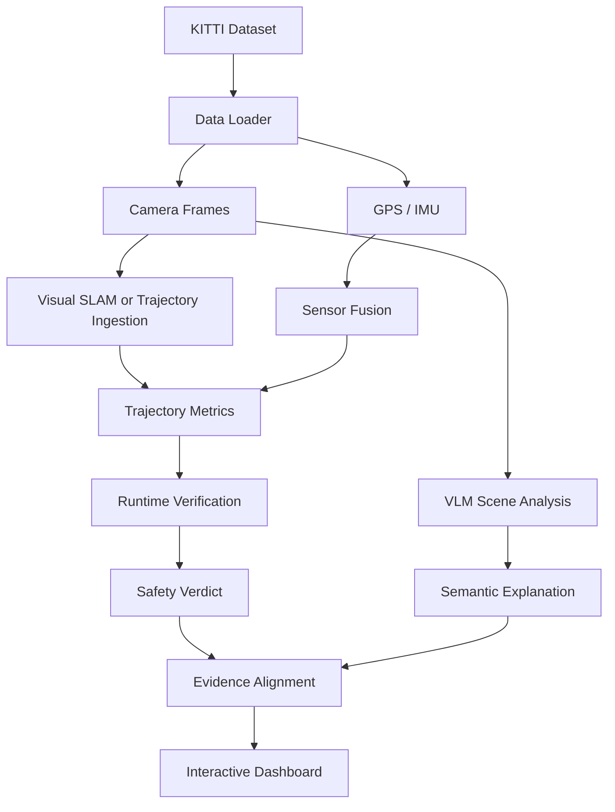

# VIGILANT

**Vision-Grounded Insights in Localization and Navigation Trust**

> Can Vision-Language Models improve the explainability and trustworthiness of localization and safety monitoring in autonomous systems without replacing formal verification methods?

[](https://www.python.org/downloads/)
[](#license)
[](#)
[](#)

VIGILANT is a research-oriented robotics/AI prototype built around KITTI-style driving data. It studies how Vision-Language Models (VLMs) can complement — not replace — formal localization and runtime verification by turning numerical failures into grounded scene explanations.

It uses the KITTI Vision dataset in `dataset/` based on raw data recording and provides a complete modular pipeline for localization, fusion, runtime verification, explanation generation, evidence checking, and dashboard visualization.

## Table of Contents

- [Overview](#overview)
- [Features](#features)
- [Objectives](#objectives)
- [Tech Stack](#tech-stack)
- [Problem It Solves](#problem-it-solves)
- [Workflow](#workflow)
- [Main Modules](#main-modules)
- [Results](#results)
- [Quick Start](#quick-start)
- [Reproducible Experiment Workflow](#reproducible-experiment-workflow)
- [VLM Evaluation](#vlm-evaluation)
- [Alternative Runs](#alternative-runs)
- [Outputs](#outputs)
- [Validation Status](#validation-status)
- [Current Limitations](#current-limitations)
- [Next Research Steps](#next-research-steps)
- [Helpful References](#helpful-references)
- [Repository Layout](#repository-layout)
- [Contributing](#contributing)
- [Citation](#citation)
- [License](#license)

## Overview

Autonomous systems typically surface failures as bare numeric outputs: localization error, tracking quality, runtime safety verdicts, and robustness scores. These quantities are necessary but silent — they rarely explain *why* a failure occurred.

VIGILANT closes that gap with a hybrid neuro-symbolic design: formal runtime verification remains the safety gatekeeper, numerical trajectory metrics provide objective evidence, and a Vision-Language Model (VLM) supplies grounded scene explanations. An evidence-alignment step (metric-linked evidence alignment, MLEA) checks whether VLM claims matching predefined keyword categories are consistent with localization telemetry, flagging claims that deserve human review. MLEA is a proof-of-concept telemetry-consistency heuristic: it does not establish causal correctness or explanation faithfulness.

We evaluate the approach on 20 KITTI odometry sequences (8,068 frames) with real ORB-SLAM3 trajectories, pairing strict trajectory ingestion with Qwen2.5-VL scene reasoning across 81 oracle-selected failure events.

## Features

- Loads KITTI odometry sequences, calibration, GPS, IMU, and camera frames from the existing dataset.
- Estimates or ingests trajectories for localization analysis.
- Computes trajectory metrics such as ATE, RPE, and drift.
- Checks temporal safety properties using STL-inspired runtime verification.
- Uses a VLM to describe the scene and explain likely causes of localization or safety degradation.
- Scores whether VLM claims are consistent with measurable telemetry via MLEA (keyword-triggered category activations checked against telemetry thresholds; reported as a telemetry-consistency rate, not a faithfulness score).
- Evaluates VLM explanations across input-modality conditions (image-only, metrics-only, combined, perturbed-metrics), measuring surface-form output diversity.
- Measures VLM consistency (repeated runs) and inference latency.
- Computes correlations between VLM signals and quantitative safety metrics with p-values.
- Writes a structured report and renders it in a Streamlit dashboard.

## Objectives

1. Study whether VLMs can explain localization failures in a way that is grounded in observable evidence.
2. Study whether VLMs can identify hazards and operational risks that are not captured by numeric metrics alone.
3. Compare semantic explanations from VLMs against formal runtime verification outputs.
4. Build a reproducible research scaffold that can be upgraded with ORB-SLAM3, OpenVSLAM, or stronger multimodal models.

## Tech Stack

> The tools and frameworks powering VIGILANT across the full pipeline — from low-level robotics to high-level scene reasoning.

### 💻 Programming & Tooling


### 🤖 Robotics & Autonomous Systems

- **Udacity** — applied learning & curriculum
- **CARLA** — autonomous driving simulation
- **ROS2** — robotic middleware
- **Visual SLAM** — simultaneous localization & mapping
- **Visual Odometry** — vehicle motion estimation
- **Gazebo** — robot simulation
- **OpenCV** — computer vision
- **STL** — signal temporal logic for runtime verification
- **Sensor Fusion** — multi-source state estimation

### 🧠 ML & Data Analysis

- **TensorFlow** — deep learning framework
- **PyTorch** — deep learning framework
- **NumPy** — numerical computing
- **SciPy** — scientific computing
- **VLMs** — vision-language models for scene reasoning

### 🔬 Research Methods

- **Empirical Evaluation** — data-driven assessment
- **Simulation-based Testing** — validation in controlled environments
- **Test Prioritization** — efficient test selection
- **Robustness Assessment** — resilient behavior under failure

## Problem It Solves

Autonomous systems often provide only numeric outputs:

- localization error
- tracking quality
- runtime safety verdicts
- robustness scores

Those outputs are useful, but they do not explain why a failure happened.

This project addresses that gap by pairing formal monitoring with VLM-based scene reasoning. The VLM can describe what it sees and suggest causes, while runtime verification remains the safety gatekeeper.

## Workflow



## Main Modules

- `vision_language_localization/data/`: KITTI sequence loading and frame extraction
- `vision_language_localization/slam/`: mock SLAM, trajectory ingestion, and future SLAM integration
- `vision_language_localization/sensor_fusion/`: EKF fusion module (linear constant-velocity Kalman filter; called KF in the paper) with SLAM-to-GPS frame registration; weighted-blend baseline retained (`--fusion-method blend`)
- `vision_language_localization/runtime_verification/`: STL-style monitoring
- `vision_language_localization/vlm/`: rule-based, HF image, and Qwen multimodal backends
- `vision_language_localization/evaluation/`: metrics, explanation scoring, VLM evaluation, and correlation analysis
- `dashboard/`: Streamlit report viewer (including evaluation and correlation views)
- `scripts/`: runnable CLI entry points
- `annotations/`: expert annotation schema and example file

## Results

### ORB Trajectory Artifacts (Generated)

| Sequence | Trajectory File | Size |
|---|---|---:|
| 2011_09_26_drive_0009_sync | `slam/2011_09_26_drive_0009_sync.kitti.txt` | 67,161 B |
| 2011_09_26_drive_0015_sync | `slam/2011_09_26_drive_0015_sync.kitti.txt` | 44,824 B |
| 2011_09_26_drive_0023_sync | `slam/2011_09_26_drive_0023_sync.kitti.txt` | 71,251 B |
| 2011_09_26_drive_0036_sync | `slam/2011_09_26_drive_0036_sync.kitti.txt` | 121,903 B |
| 2011_09_26_drive_0093_sync | `slam/2011_09_26_drive_0093_sync.kitti.txt` | 64,898 B |

### ORB + Qwen (initial 5-sequence run; expanded evaluation now covers 20 sequences / 81 events)

> The tables below document the initial 5-sequence run (`outputs/latest_run.json`). The paper's headline evaluation now covers 20 KITTI sequences (8,068 frames) and 81 failure events, with MLEA applied across all events (1,729 verifiable claim-category matches, telemetry-consistency rate 0.70; see `outputs/ablation/mlea_81_results.json`).

| Sequence | Frames | ATE RMSE (m) | Drift Final (m) | RV Violations | Evidence Alignment | Status |
|---|---:|---:|---:|---:|---:|---|
| 2011_09_26_drive_0009_sync | 447 | 303.074 | 445.672 | 157 | 1.000 | Completed |
| 2011_09_26_drive_0015_sync | 297 | 293.076 | 529.582 | 83 | 1.000 | Completed |
| 2011_09_26_drive_0023_sync | 474 | 225.065 | 394.961 | 150 | 1.000 | Completed |
| 2011_09_26_drive_0036_sync | 803 | 353.131 | 650.552 | 194 | 0.500 | Completed |
| 2011_09_26_drive_0093_sync | 433 | 255.319 | 381.687 | 193 | 1.000 | Completed |

### Fusion: Registered EKF (initial 5-sequence run; code flag `--fusion-method ekf`)

> Note: the paper text refers to this filter as KF (the implementation is a linear constant-velocity Kalman filter); the code identifiers retain the `ekf` name.

The EKF registers the ORB-SLAM3 export to the GPS frame (similarity transform from the first 50 frames with adequate tracking quality), then fuses SLAM position, GPS, and IMU-derived velocity. Compare against the raw imported SLAM columns above.

| Sequence | SLAM ATE RMSE (m) | SLAM Drift (m) | Fusion ATE RMSE (m) | Fusion Drift (m) |
|---|---:|---:|---:|---:|
| 2011_09_26_drive_0009_sync | 303.074 | 445.672 | 4.586 | 1.718 |
| 2011_09_26_drive_0015_sync | 293.076 | 529.582 | 2.250 | 3.533 |
| 2011_09_26_drive_0023_sync | 225.065 | 394.961 | 4.895 | 0.613 |
| 2011_09_26_drive_0036_sync | 353.131 | 650.552 | 4.909 | 1.255 |
| 2011_09_26_drive_0093_sync | 255.319 | 381.687 | 12.731 | 6.488 |

> Note: a large share of the raw SLAM ATE is frame misregistration between the ORB export and the GPS frame — rigidly aligned, the same trajectories achieve sub-meter ATE. The EKF resolves this automatically through registration, then improves the estimate further by fusing both sources.

Result source: `outputs/latest_run.json`

### Key Findings (paper headline results: 20 sequences, 81 events)

- Frame registration accounts for the largest ATE reduction (raw SLAM mean ATE 305.6 m → 24.9 m aligned, primarily reflecting frame registration rather than localization improvement); KF fusion further reduces mean ATE to 15.3 m in 15 of 20 sequences (Wilcoxon p = 0.006), though partially confounded by GPS/reference circularity.
- An 81-event input-modality ablation with Qwen2.5-VL shows image-containing inputs produce substantially more unique output strings than metrics alone (59 vs. 5 under exact-string matching; surface-form diversity, not semantic diversity).
- MLEA, applied across all 81 events (1,729 verifiable claim-category matches plus 6 unverifiable GPS matches), achieves a telemetry-consistency rate of 0.70 with wide per-category variation (100% for dynamic objects/road geometry; 3.6% for low feature support; 0% for safety violation).
- The initial 5-sequence run below showed evidence alignment of 1.000 on 4 of 5 sequences, with `2011_09_26_drive_0036_sync` at 0.500 — a useful indicator for follow-up manual review.

### Analysis of Achieved Results

**1. The dominant error in the raw SLAM numbers is frame misregistration, not tracking quality.** Rigid (Umeyama) alignment of the ORB-SLAM3 exports to the GPS frame reduces ATE RMSE from 225-353 m to 0.15-0.94 m on four of five sequences. In other words, the exported trajectories are highly accurate within their own visual frame; the large raw ATE reflects the arbitrary origin/rotation of the ORB export relative to the global GPS frame. Only `2011_09_26_drive_0093_sync` remains genuinely degraded (52 m even after full alignment), indicating real tracking difficulty there.

**2. The registered EKF fusion converts this into a deployable estimate.** By registering the visual frame from the first 50 frames and then fusing SLAM, GPS, and IMU-derived velocity, the EKF reduces ATE RMSE to 2.3-12.7 m and final drift to 0.6-6.5 m across all sequences — a roughly 30-100x improvement over the raw imports. 

**3. Runtime verification flags all five sequences, but mostly as a consequence of misregistration.** STL robustness is strongly negative on every sequence (down to -650) because the position-error property is evaluated against the *unaligned* ORB exports. Once registration is applied, the same underlying trajectories satisfy the error threshold to well under a meter, so the RV verdicts here reflect frame inconsistency rather than tracking failure. This is itself a useful finding: RV signals are only interpretable when the localization estimate is in the same frame as the reference — exactly the coupling that fusion provides.

**4. The VLM contributes scene-level reasoning, not metric vocabulary.** Qwen explanations describe visual causes (motion blur, signage, occlusions) and consistently flag localization-uncertainty and safety risks on the real peak-error frames. Keyword-level claim matching against telemetry thresholds is therefore lexical rather than semantic: a trigger word (e.g., "feature", "geometric") does not establish that the VLM's claim is truly about the corresponding telemetry condition. This is precisely the semantic gap the paper documents — the most discriminating MLEA categories are also the least trustworthy.

**5. Modality results measure surface-form diversity, not explanation quality.** Image-containing inputs produce substantially more unique output strings (59–62 vs. 5), but exact-string uniqueness does not measure semantic diversity, grounding, or faithfulness. Hazard-category overlap (Jaccard 0.68–0.75 across conditions) suggests the model's hazard vocabulary is not determined solely by input modality.

**6. Overall assessment.** The pipeline is end-to-end operational: real ORB-SLAM3 trajectories across 20 sequences, registered KF fusion, STL runtime verification, VLM scene explanation across 81 events, and telemetry-consistency scoring all run reproducibly on KITTI data. MLEA is positioned as a proof-of-concept audit — it flags claims inconsistent with predefined telemetry rules but does not establish causal correctness or faithfulness. Known limitations (GPS/reference circularity, oracle event selection, heuristic mappings) are documented in the paper's Discussion section.

## Quick Start

1. Create and activate a Python environment. The recommended environment is the local `.venv` in this repository.
2. Install the Python dependencies and the project itself:

```bash
python -m pip install -r requirements.txt
python -m pip install -r requirements_vlm_local.txt
python -m pip install -e .
```

3. Run the baseline pipeline:

```bash
python scripts/run_pipeline.py --dataset-root dataset --output-root outputs --max-frames 300
```

4. Open the dashboard:

```bash
streamlit run dashboard/app.py
```

## Reproducible Experiment Workflow

This project supports two levels of experimentation:

1. Baseline experimentation using the internal mock SLAM backend.
2. Full experimentation using real ORB-SLAM3 trajectories and a multimodal VLM.

### Step 0: Clone ORB-SLAM3 and Pangolin

This workflow runs on the real ORB-SLAM3 system. Start by cloning the
[UZ-SLAMLab ORB-SLAM3](https://github.com/UZ-SLAMLab/ORB_SLAM3) repository (and
its Pangolin dependency) into the vendored `slam/` folder, where the rest of the
pipeline and the WSL build script expect them:

```bash
git clone https://github.com/UZ-SLAMLab/ORB_SLAM3.git slam/ORB_SLAM3
git clone https://github.com/stevenlovegrove/Pangolin.git slam/Pangolin
```

If these folders already exist, Step 2 will reuse them.

### Step 1: Prepare ORB-SLAM3 input sequences

Convert the raw KITTI-style synced data into the stereo layout expected by ORB-SLAM3:

```bash
python scripts/prepare_orbslam3_kitti.py --sequence-id 2011_09_26_drive_0009_sync
```

To prepare all available sequences:

```bash
python scripts/prepare_orbslam3_kitti.py
```

This creates per-sequence prepared folders under `slam/prepared/` with:

- `image_0/`
- `image_1/`
- `times.txt`
- `settings.yaml`

### Step 2: Build ORB-SLAM3 in WSL

This repository vendors both `ORB_SLAM3` and `Pangolin` under `slam/` and builds them inside Ubuntu WSL.

```bash
wsl -d Ubuntu-22.04 -- bash -lc 'cd /mnt/c/Users/Qurban/Documents/GitHub/VLM && bash scripts/wsl_build_orbslam3.sh'
```

If a Linux package is missing, the script reports the exact package name and install command.

### Step 3: Export real trajectories

Run ORB-SLAM3 on a prepared sequence and export a KITTI-format trajectory:

```bash
wsl -d Ubuntu-22.04 -- bash -lc 'cd /mnt/c/Users/Qurban/Documents/GitHub/VLM && bash scripts/wsl_run_orbslam3_kitti.sh 2011_09_26_drive_0009_sync'
```

Output trajectory files are written to the top-level `slam/` folder as:

- `slam/<sequence_id>.kitti.txt`

### Step 4: Run the evaluation pipeline with real trajectories

Use strict trajectory matching so the experiment fails if any required ORB file is missing:

```bash
python scripts/run_pipeline.py \
  --slam-backend trajectory_file \
  --trajectory-root slam \
  --strict-trajectory-matching \
  --vlm-backend qwen_vl \
  --vlm-model-name Qwen/Qwen2.5-VL-3B-Instruct \
  --vlm-max-new-tokens 180 \
  --vlm-temperature 0.0 \
  --max-sequences 5 \
  --max-frames 10000
```

### Step 5: Inspect outputs

The final report is written to:

- `outputs/latest_run.json`
- `outputs/latest_run.csv`

The dashboard reads the JSON report directly:

```bash
streamlit run dashboard/app.py
```

## VLM Evaluation

The paper's headline VLM evaluation is MLEA (telemetry-consistency scoring across 81 events; see `outputs/ablation/mlea_81_results.json`) plus the input-modality ablation (surface-form diversity across image-only / metrics-only / combined / perturbed-metrics conditions). The repository additionally retains an earlier annotation-based evaluation protocol with three components:

1. **Annotation-based metrics** — comparing VLM explanations against expert labels for claim accuracy (precision/recall/F1), hazard identification (precision/recall/F1), and hallucination rate. See `annotations/example_annotations.json` for the schema. (Note: the paper de-emphasizes these metrics in favor of MLEA; the example annotations are illustrative placeholders, not expert labels.)
2. **Reliability metrics** — consistency (repeated runs on the same scene, reported as mean pairwise Jaccard similarity) and inference latency.
3. **Correlation analysis** — pairwise Pearson/Spearman correlations (with permutation p-values) between VLM signals and quantitative safety metrics.

### Step 6: Run the evaluation

```bash
python scripts/evaluate_vlm.py \
  --report outputs/latest_run.json \
  --annotations annotations/example_annotations.json \
  --output-root outputs
```

The result is written to `outputs/evaluation_report.json` and rendered by the dashboard. For details on the taxonomy, annotation format, and reporting guidance, see `docs/evaluation.md`.

## Alternative Runs

### External SLAM trajectory ingestion

Use this when you have exported trajectories from ORB-SLAM3, OpenVSLAM, or another SLAM system.

```bash
python scripts/run_pipeline.py \
  --dataset-root dataset \
  --output-root outputs \
  --slam-backend trajectory_file \
  --trajectory-root slam \
  --trajectory-file-suffix .kitti.txt
```

For a concrete ORB-SLAM3 preparation and export workflow, see `docs/orbslam3_integration.md`.

### Fusion backends

The default is the registered EKF (`--fusion-method ekf`); the earlier weighted-blend baseline remains available for comparison:

```bash
python scripts/run_pipeline.py \
  --dataset-root dataset \
  --output-root outputs \
  --fusion-method blend
```

See `docs/fusion.md` for the EKF model, parameters, and frame-registration rationale.

### Local HF image backend

This backend generates a scene caption from an image and combines it with localization metrics.

```bash
python scripts/run_pipeline.py \
  --dataset-root dataset \
  --output-root outputs \
  --vlm-backend hf_local \
  --vlm-model-name Salesforce/blip-image-captioning-base
```

### Qwen multimodal backend

This is the strongest scene-reasoning path currently wired into the project.

```bash
python scripts/run_pipeline.py \
  --dataset-root dataset \
  --output-root outputs \
  --vlm-backend qwen_vl \
  --vlm-model-name Qwen/Qwen2.5-VL-3B-Instruct \
  --vlm-max-new-tokens 180 \
  --vlm-temperature 0.0
```

## Outputs

The pipeline writes a structured report to `outputs/latest_run.json` with:

- sequence ID
- SLAM metrics
- fusion metrics
- runtime verification results
- VLM explanation
- scene caption, when available
- evidence alignment score

For tabular analysis, the latest full report was also exported to `outputs/latest_run.csv`.

The evaluation step writes `outputs/evaluation_report.json` with:

- aggregate and per-sequence explanation metrics (claim/hazard P/R/F1, hallucination rate)
- consistency and latency, when recorded by the pipeline
- Correlation table with p-values

## Validation Status

- Baseline pipeline runs successfully on the provided dataset.
- Image-based VLM prompting works on real KITTI frames.
- Qwen multimodal inference works in the local `.venv` environment (RTX 3050 Ti, 4-bit quantization, 42–60 s per frame).
- The project now includes telemetry-consistency scoring (MLEA) applied across 81 events / 308 VLM outputs (`outputs/ablation/mlea_81_results.json`).
- ORB-SLAM3 trajectories were generated for 20 KITTI sequences (8,068 frames total).
- End-to-end strict trajectory ingestion (`trajectory_file`) succeeded across all sequences.
- The VLM evaluation module computes MLEA alignment scores, consistency, latency, and modality-ablation diversity.
- The registered KF fusion (SLAM + GPS + OXTS-derived velocity) runs end-to-end across all 20 sequences.

## Contributing

This is a research prototype. Contributions that advance the stated research questions are welcome — especially in the areas listed under [Next Research Steps](#next-research-steps).

For substantial changes, please open an issue first to discuss the direction before submitting a pull request.

## License

Distributed under the MIT License. A `LICENSE` file has not been added yet — see [Contributing](#contributing) if you would like to help finalize the licensing for this project.
